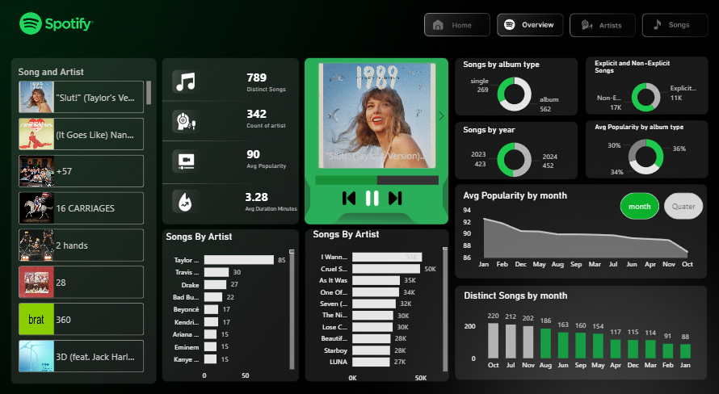

# 🎵 Spotify Music Trends Analysis Dashboard (2023–2024)

## 📌 Project Overview
This project is a complete Spotify music analytics dashboard built using Excel and Power BI.  
The dataset contains song performance data from 2023 to 2024, including trending songs, artist popularity, streaming performance, regional trends, and hit vs flop analysis.

The raw data was first cleaned and transformed in Excel, then imported into Power BI where advanced calculations and KPIs were created using DAX formulas to build an interactive dashboard.

---

## 🚀 Features

- 🎧 Trending vs Flop Songs Analysis
- 📈 Artist Popularity & Performance Tracking
- 🌍 Region-wise Song Popularity Insights
- 🔥 Most Streamed Songs & Artists
- 📊 Interactive KPI Cards & Visualizations
- 📅 Year-wise Music Trend Analysis
- 🎼 Genre & Song Performance Insights
- ⚡ Advanced DAX Calculations

---

## 🛠️ Tools & Technologies Used

- **Microsoft Excel**
  - Data Cleaning
  - Data Transformation
  - Preprocessing

- **Power BI**
  - Dashboard Development
  - Data Modeling
  - Data Visualization
  - DAX Measures & KPIs

- **DAX**
  - Custom Calculations
  - Performance Metrics
  - Dynamic Measures

---

## 📂 Workflow

1. Collected Spotify songs dataset
2. Cleaned and transformed data using Excel
3. Imported dataset into Power BI
4. Created relationships and data model
5. Developed DAX measures for KPIs
6. Built an interactive dashboard with visuals and insights

---

## 📊 Dashboard Insights

The dashboard helps analyze:

- Which songs performed best during 2023–2024
- Which artists dominated Spotify trends
- Regional listening behavior
- Song popularity distribution
- Performance comparison between hit and flop songs

---

## 📸 Dashboard Preview

---

## 📁 Project Files

- `Spotify_Dashboard.pbix`
- `Spotify_Data.xlsx`
- `README.md`

---

## ⭐ Conclusion

This project demonstrates practical skills in:
- Data Cleaning
- Data Analysis
- Data Visualization
- Business Intelligence
- Power BI Dashboarding
- DAX Calculations

It also showcases how music streaming data can be transformed into meaningful business insights through analytics.

---

## 👨‍💻 Author

**Kushagra**
